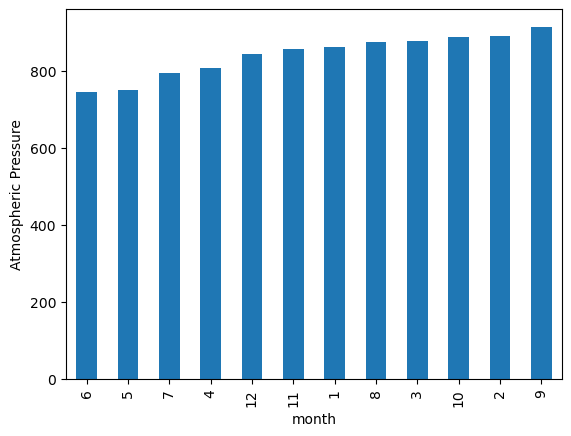

# data-collection-challenge
### - Overview
- Module 11 Data Collection Challenge files
- Author: Vinny Shankar
- Acknowledgements:
    - Study Groups: worked together with several students to understand the assignment
    - Classmates: [Hany Dief](https://github.com/hanydief), [Jed Miller](https://github.com/Jed-Miller), and [Ajay Gopalkrishna](https://github.com/ajoyg) were instrumental in helping understand BeautifulSoup object structure
    - Program: University of California Berkeley Data Analytics Bootcamp
    - Starter Code: The Module Challenge provided starter code that guided the process
    - Instructor: Ahmad Sweed
    - Tutor: Bethany Lindberg
### - Contents
- One `Mars` folder containing:
    * A Jupyter Notebook of article titles and preview text scraped from html
    * A Jupyter Notebook of quantitative analysis on table data scraped from html
    * An output folder containing the scraped table data in the form of a .csv file and four .png files from the quantitative analysis
- This README.md file
### - Mars Average Minimum Temperature Analysis
* A plot of average minimum temperature in Celsius per Martian month            
* The plot shows that, on average,` the third month has the lowest minimum temperature` and `the eighth month has the highest minimum temperature`          

### - Mars Average Atmospheric Pressure Analysis
* A plot of average atmospheric pressure per Martian month
* The plot shows that, on average,` the sixth month has the lowest atmospheric pressure` and `the ninth month has the highest atmospheric pressure`

### - Number of Earth Days in a Martian Year
- A plot of minimum temperature recording on Mars per Earth day
- Assuming that Mars orbits the Sun once between temperature peaks, looking at the number of days between peaks should give a rough estimate of the number of terrestrial days in a Martian year.
- Going from one peak (Day 750, Min Temp -65C) to the next peak (Day 1425, Min Temp -67C), we can eastimate that (1425 - 750) = roughly 675 terrestrial days occur during a Martian year.
- According to [NASA](https://mars.nasa.gov/resources/21392/mars-in-a-minute-how-long-is-a-year-on-mars/), there are approximately 687 Earth days in a Martian year. Our estimate of 675 is about 2% lower than the official number.

